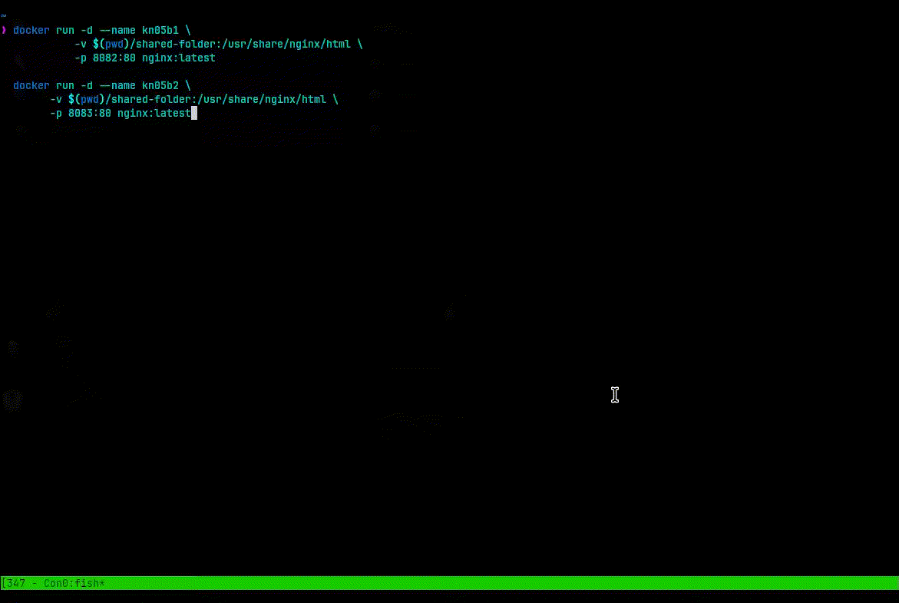

# KN05: Arbeit mit Speicher

## A) Bind Mounts

Befehl um Container mit Volumen zu starten:

```bash
docker run -d --name kn05a \  
 -v $(pwd)/shared-folder:/usr/share/nginx/html \  
 -p 8080:80 \  
 nginx:latest
```


_Video 1: Script Ausführung durch den Container_

## B) Volumes

Befehl um beide Container mit Volumen zu starten:

```bash
docker run -d --name kn05b1 \
      -v $(pwd)/shared-folder:/usr/share/nginx/html \
      -p 8082:80 nginx:latest

docker run -d --name kn05b2 \
	  -v $(pwd)/shared-folder:/usr/share/nginx/html \
	  -p 8082:80 nginx:latest
```

Video des Prozesses:



_Video 2: Script Ausführung durch beide Container_
## C) Speicher mit docker compose

Ausgabe des `mount` Befehls vom ersten Container:


_Abbildung 1: Mount Befehl von nginx1_

Ausgabe des `mount` Befehls vom zweiten Container:


_Abbildung 2: Mount Befehl von nginx2_

Docker Compose Datei:


## Definitionen 

### Named Volumes

Ein **named volume** ist ein Volumen das von Docker verwaltet wird. Es wird in Dockers Volumenverwaltungssystem gespeichert (`/var/lib/docker/volumes/`). Named Volumes sind einfacher zu handhaben und bieten mehr Funktionalität als Bind Mounts. 

**So wird ein `named volume` erstellt:**

```yaml
version: "3.9"

services:
  db:
    image: postgres:latest
    volumes:
      - data-volume:/var/lib/postgresql/data

volumes:
  data-volume:
```

### Bind Mounts

Ein **bind mount** ist ein Dateisystempfad auf dem Host, der in den Container gemountet wird. Der Pfad auf dem Host wird beim Starten des Containers angegeben. 

**So wird ein `bind mount` erstellt:**

**Long Syntax:**
```yaml
version: "3.9"

services:
  db:
    image: postgres:latest
    volumes:
      - type: bind
        source: ./data
        target: /var/lib/postgresql/data
```

**Short Syntax:**
```yaml
version: "3.9"

services:
  db:
    image: postgres:latest
    volumes:
      - ./data:/var/lib/postgresql/data
```

### Tmpfs Mounts

Ein **tmpfs mount** ist ein temporäres Dateisystem, das im Arbeitsspeicher des Hosts gespeichert wird. Es wird gelöscht, wenn der Container beendet wird. 

**So wird ein `tmpfs mount` erstellt:**


**Long Syntax:**
```yaml
version: "3.9"

services:
  db:
    image: postgres:latest
	volumes:
      - type: tmpfs
        target: /var/lib/postgresql/data
```

**Short Syntax:**
```yaml
version: "3.9"

services:
  db:
    image: postgres:latest
    tmpfs:
      - /var/lib/postgresql/data
```
